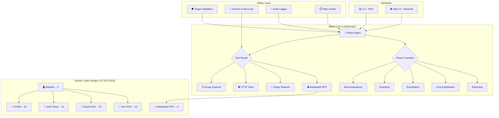
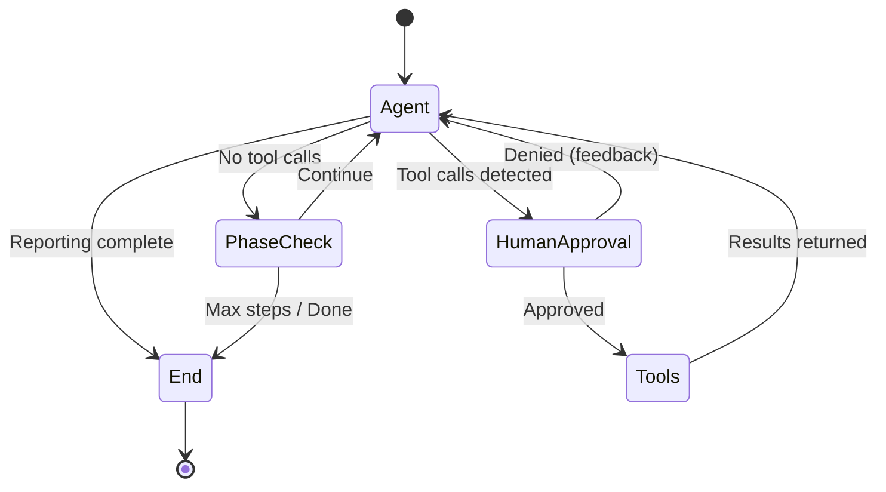

# 🔴 Red Team Agent

**Autonomous AI-Powered Offensive Security Framework**

An industry-ready LangGraph-based red teaming agent that autonomously performs **Reconnaissance → Scanning → Exploitation → Post-Exploitation** within a controlled Docker-based cyber range, then triages findings and suggests remediations.

> **⚠️ ETHICAL USE ONLY** — This tool is designed exclusively for authorized security testing in isolated lab environments. Never use against systems without explicit written authorization.

---

## 📋 Table of Contents

- [Architecture](#-architecture)
- [Features](#-features)
- [Tech Stack](#-tech-stack)
- [Quick Start](#-quick-start)
- [Project Structure](#-project-structure)
- [Cyber Range](#-cyber-range)
- [Usage](#-usage)
- [Safety & Guardrails](#-safety--guardrails)
- [Evaluation](#-evaluation)
- [Development](#-development)
- [Ethics & Responsible Use](#-ethics--responsible-use)

---

## 🏗️ Architecture



### Agent Graph Flow



---

## ✨ Features

| Feature | Description |
|---------|-------------|
| **Autonomous Kill Chain** | Walks through recon → scan → exploit → post-exploit → report |
| **LangGraph ReAct Agent** | Stateful reasoning with tool calling and memory |
| **11 Security Tools** | Nmap, Scapy, HTTP probing, Metasploit integration |
| **Human-in-the-Loop** | Exploit actions require operator approval |
| **Audit Trail** | Every action logged to tamper-evident JSONL |
| **Target Sandboxing** | Network-level isolation prevents scope creep |
| **Phase-Aware Prompts** | Dynamic system prompts adapt to current kill-chain phase |
| **Evaluation Framework** | Quantitative metrics: detection rate, exploitation success |
| **CLI + Web UI** | Rich terminal interface and Streamlit dashboard |
| **Docker Cyber Range** | 4 vulnerable targets on an air-gapped network |

---

## 🛠️ Tech Stack

| Component | Technology |
|-----------|------------|
| Agent Framework | LangGraph + LangChain |
| LLM | Ollama (qwen2.5-coder:14b) |
| Scanning | python-nmap, Scapy |
| Exploitation | pymetasploit3 (Metasploit RPC) |
| Web Probing | requests |
| CLI | Rich |
| Web UI | Streamlit |
| Config | Pydantic Settings |
| Logging | structlog (JSON) |
| Containers | Docker + docker-compose |
| Deps | Poetry |
| Testing | pytest |
| Linting | Ruff, mypy |

---

## 🚀 Quick Start

### Prerequisites

- Python 3.12+
- [Poetry](https://python-poetry.org/docs/#installation)
- [Docker](https://docs.docker.com/get-docker/) & Docker Compose
- [Ollama](https://ollama.ai) with a model pulled

### 1. Clone & Install

```bash
git clone https://github.com/your-username/red-team-agent.git
cd red-team-agent

# Install dependencies
poetry install

# Copy environment config
cp .env.example .env
```

### 2. Pull the LLM Model

```bash
ollama pull qwen2.5-coder:14b
# Or a smaller model for testing:
ollama pull qwen2.5-coder:7b
```

### 3. Launch the Cyber Range

```bash
# Build and start all containers
docker-compose up -d

# Verify targets are running
docker-compose ps
```

### 4. Run the Agent

```bash
# CLI mode
poetry run redteam run --target 172.20.0.0/24

# Or with a specific model
poetry run redteam run --model qwen2.5-coder:7b

# Web UI mode
poetry run streamlit run src/ui/app.py
```

---

## 📁 Project Structure

```
red_team_agent/
├── src/
│   ├── __init__.py              # Package root
│   ├── config.py                # Pydantic settings (env-driven)
│   ├── logging.py               # Structured audit logging
│   ├── guardrails.py            # Safety: target validation, HITL, blocklists
│   ├── evaluation.py            # Success metrics & scoring framework
│   ├── cli.py                   # Rich-powered CLI
│   ├── agent/
│   │   ├── __init__.py
│   │   ├── state.py             # AgentState TypedDict + Finding dataclass
│   │   ├── prompts.py           # Phase-aware system prompts
│   │   └── graph.py             # LangGraph ReAct agent (core)
│   ├── tools/
│   │   ├── __init__.py
│   │   ├── nmap_tools.py        # Port scanning & OS detection
│   │   ├── network_tools.py     # Scapy: ping sweep, SYN scan, banners
│   │   ├── http_tools.py        # HTTP recon & directory brute-force
│   │   └── metasploit_tools.py  # MSF search, exploit, sessions
│   └── ui/
│       ├── __init__.py
│       └── app.py               # Streamlit dashboard
├── cyber_range/
│   ├── attacker/
│   │   ├── Dockerfile
│   │   └── requirements.txt
│   ├── struts_rce/
│   │   ├── Dockerfile
│   │   └── struts-app/
│   └── vuln_ssh/
│       └── Dockerfile
├── tests/
│   ├── __init__.py
│   ├── test_core.py             # Unit tests: guardrails, config, logging
│   └── test_graph.py            # Integration tests: graph, tools, phases
├── logs/                        # Audit trail (gitignored)
├── docker-compose.yml           # Cyber range orchestration
├── pyproject.toml               # Poetry config + tool settings
├── .env.example                 # Environment template
├── .gitignore
└── README.md                    # This file
```

---

## 🐳 Cyber Range

The Docker Compose environment creates an **isolated, air-gapped network** (`172.20.0.0/24`, `internal: true`) with:

| Container | IP | Description |
|-----------|-----|-------------|
| `rt-attacker` | 172.20.0.2 | Attacker machine with all tools |
| `rt-msfrpcd` | 172.20.0.5 | Metasploit RPC daemon |
| `rt-dvwa` | 172.20.0.10 | DVWA — SQL injection, XSS, command injection |
| `rt-juiceshop` | 172.20.0.11 | OWASP Juice Shop — modern web vulns |
| `rt-struts-rce` | 172.20.0.12 | Apache Struts2 RCE (CVE-2017-5638) |
| `rt-vuln-ssh` | 172.20.0.13 | SSH with weak credentials + exposed secrets |

> **Network is `internal: true`** — no outbound internet access from any container.

---

## 💻 Usage

### CLI Commands

```bash
# Full engagement
poetry run redteam run

# Custom target & objective
poetry run redteam run \
  --target 172.20.0.0/24 \
  --objective "Focus on web application vulnerabilities" \
  --model qwen2.5-coder:7b

# View audit log
poetry run redteam report --log-file logs/audit.jsonl
```

### Web UI

```bash
poetry run streamlit run src/ui/app.py
```

The Streamlit dashboard provides:
- **Dashboard** — Real-time phase progress, step counter, metrics
- **Findings** — Severity-sorted vulnerability cards
- **Audit Log** — Searchable, filterable action trail
- **Report** — Generated security assessment

---

## 🛡️ Safety & Guardrails

Safety is a **first-class concern** in this framework. Multiple layers of protection prevent misuse:

### 1. Target Subnet Validation
Every tool call validates that the target IP falls within `ALLOWED_TARGET_SUBNET` (default: `172.20.0.0/24`). Requests to external IPs are **immediately rejected**.

### 2. Human-in-the-Loop (HITL)
Exploit-type actions (e.g., `msf_run_exploit`) display a Rich-formatted approval prompt:

```
┌─ ⚠️  Human-in-the-Loop Approval Required ──────────┐
│ Tool:        msf_run_exploit                         │
│ Target:      172.20.0.12                             │
│ Risk Level:  critical                                │
│ Parameters:                                          │
│   • module: exploit/multi/http/struts2_content_...   │
│   • payload: generic/shell_reverse_tcp               │
│ Do you approve this action? [y/N]                    │
└──────────────────────────────────────────────────────┘
```

### 3. Step Limiting
The agent is hard-capped at `MAX_AGENT_STEPS` (default: 50) to prevent runaway loops.

### 4. Blocked Command Patterns
Shell commands containing destructive patterns (`rm -rf /`, fork bombs, etc.) are blocked at the guardrail layer.

### 5. Docker Network Isolation
The cyber range network is declared `internal: true` — **no traffic can route to the internet**.

### 6. Audit Trail
Every tool invocation, approval decision, and phase transition is recorded to an append-only JSONL log for forensic review.

---

## 📊 Evaluation

The evaluation framework (`src/evaluation.py`) measures agent performance across three dimensions:

| Metric | Description |
|--------|-------------|
| **Detection Rate** | % of expected vulnerabilities found per target |
| **Exploitation Success** | % of targets where exploitation succeeded |
| **Phase Completion** | % of kill-chain phases completed per target |

### Expected Results (Cyber Range)

| Target | Expected Vulns | Difficulty |
|--------|---------------|------------|
| DVWA | SQLi, XSS, Command Injection, File Upload, CSRF | Easy |
| Juice Shop | SQLi, XSS, Broken Auth, IDOR, Misconfig | Medium |
| Struts RCE | CVE-2017-5638, Content-Type Injection | Medium |
| Vuln SSH | Weak Creds, Root Login, Data Exposure | Easy |

---

## 🔧 Development

```bash
# Run tests
poetry run pytest -v

# Run with coverage
poetry run pytest --cov=src --cov-report=term-missing

# Lint
poetry run ruff check src/ tests/
poetry run ruff format src/ tests/

# Type check
poetry run mypy src/
```

---

## ⚖️ Ethics & Responsible Use

### Intended Use
This tool is designed **exclusively** for:
- Authorized penetration testing in controlled lab environments
- Security research and education
- Evaluating AI agent capabilities in offensive security contexts
- Demonstrating red team automation with safety guardrails

### Prohibited Use
- Unauthorized access to any system
- Targeting production systems without explicit written authorization
- Bypassing safety guardrails for malicious purposes
- Use in any context that violates applicable laws or regulations

### Design Principles
1. **Safety by default** — All exploit actions require human approval
2. **Scope enforcement** — Network-level isolation prevents scope creep
3. **Full auditability** — Every action is logged for forensic review
4. **Graduated risk** — Tool registry tags each action with a risk level
5. **Fail-safe** — Agent stops at step limit; denied actions provide feedback

### Responsible AI in Offensive Security
This project demonstrates that AI-powered red teaming can be both **effective and safe** when designed with proper guardrails. The key insight is that autonomous capability and human oversight are complementary, not contradictory — the agent handles tedious enumeration while humans approve high-risk decisions.

---

## 📄 License

MIT License — See [LICENSE](LICENSE) for details.

---

<p align="center">
  Built with 🔴 for the Anthropic Frontier Red Team
</p>
